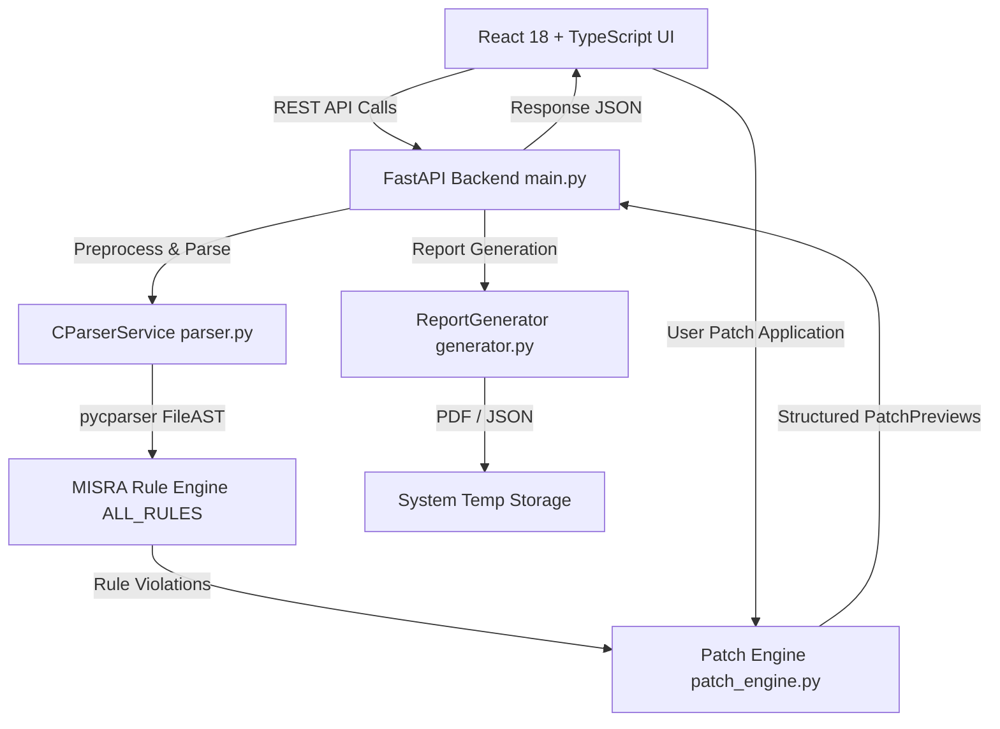

# AI-Powered MISRA C:2012 Static Compliance & Automated Code Review Platform

[](LICENSE)
[](https://www.python.org/)
[](https://react.dev/)
[](https://fastapi.tiangolo.com/)
[](https://www.misra.org.uk/)

> An enterprise-grade, human-in-the-loop static analysis and automated remediation workstation for safety-critical C software engineering in automotive (ISO 26262), aerospace (DO-178C), and medical device (IEC 62304) domains.

---

## Table of Contents

- [Overview](#overview)
- [Problem Statement](#problem-statement)
- [Core Objectives](#core-objectives)
- [Key Features](#key-features)
- [System Architecture](#system-architecture)
- [Technology Stack](#technology-stack)
- [End-to-End Workflow](#end-to-end-workflow)
- [Implemented MISRA C:2012 Rules](#implemented-misra-c2012-rules)
- [API Overview](#api-overview)
- [Directory Structure Summary](#directory-structure-summary)
- [Installation & Setup Guide](#installation--setup-guide)
- [Usage Guide](#usage-guide)
- [Report & Artifact Exports](#report--artifact-exports)
- [Current Limitations](#current-limitations)
- [Future Roadmap](#future-roadmap)
- [Deep Technical Documentation](#deep-technical-documentation)
- [License & Acknowledgements](#license--acknowledgements)

---

## Overview

The **MISRA C:2012 Compliance Platform** bridges deterministic static code checking and modern software engineering by combining a **deterministic Abstract Syntax Tree (AST) parser engine (`pycparser`)**, an **offset-based range patch generator**, an interactive **Monaco side-by-side diff code review UI**, and an **optional local TinyLlama explanation assistant**.

Unlike traditional static analyzers that produce unmanageable text logs, or unconstrained generative AI tools that risk hallucinating syntax errors, this workstation employs a **Human-in-the-Loop paradigm**: every proposed code fix is rendered as an interactive diff preview, granting developers full authority to **Accept**, **Reject**, **Skip**, or **Manually Refine** patches before modifying the working codebase.

---

## Problem Statement

1. **Safety-Critical Risks in ISO C**: C allows dangerous undefined, unspecified, and implementation-defined behaviors (e.g. implicit type truncation, unparenthesized operator precedence, missing switch breaks, octal literal confusion) that can cause catastrophic failures in automotive Engine Control Units (ECUs) or medical devices.
2. **Review Bottlenecks**: Commercial analyzers produce thousands of static warning lines, requiring engineers to spend hundreds of hours manually searching codebases, interpreting warnings, and writing fixes.
3. **The Danger of Unchecked AI Auto-Fixing**: Unconstrained LLMs can hallucinate non-existent functions, break pointer arithmetic, or introduce subtle compilation errors in safety-critical code.

---

## Core Objectives

- **Deterministic Rule Detection**: Eliminate false syntax matches by evaluating C source code directly at the Abstract Syntax Tree (AST) node level.
- **Interactive Diff Previews**: Render side-by-side code diffs using Monaco Editor (the same editor engine powering VS Code).
- **Safe Range Patching**: Execute code fixes using range-targeted byte offset replacements sorted in descending order (bottom-up patching) to prevent coordinate desynchronization.
- **Metric Invariants**: Enforce mathematically consistent counter equations ($\text{Accepted} + \text{Rejected} + \text{Skipped} + \text{Manual} + \text{Remaining} = \text{Total Detected}$) across all dashboard views and PDF exports.
- **Stateless Storage**: Generate PDF reports and ZIP archives in system temp storage, streaming downloads via background cleanup tasks to ensure zero disk footprint.

---

## Key Features

- 🔍 **10 Core AST MISRA Detectors**: Deterministic AST-driven analysis for Rules 2.2, 2.7, 7.1, 8.4, 8.7, 10.3, 12.1, 14.4, 16.3, and 16.4.
- ⚡ **Side-by-Side Monaco Diff Viewer**: Interactive code review workstation displaying original vs proposed patch snippets.
- 🛠️ **Pre-Filled Manual Fix Workflow**: Pre-fills the code editor with the analyzer's best safe suggestion so engineers can refine logic or formatting before applying.
- 📦 **Bulk Auto-Patch Engine**: Bottom-up range patch engine with post-patch AST re-parsing syntax validation.
- 🤖 **Hybrid LLM Infrastructure**: Instant offline structured explanations backed by a local TinyLlama Ollama API client.
- 📄 **Publication-Grade PDF/JSON Reports**: Programmatic ReportLab PDF generation with clean string sanitization (zero black square glyph artifacts).
- 📁 **Multi-File Folder Batch Mode**: Folder processing mode with multi-file selection and ZIP archive export.

---

## System Architecture



---

## Technology Stack

| Layer | Technology | Primary Purpose |
| :--- | :--- | :--- |
| **Frontend UI** | React 18, TypeScript, Vite | Component-driven user interface and strict state management |
| **Code Editor** | Monaco Editor (`@monaco-editor/react`) | Interactive side-by-side code diff editing |
| **Styling** | Tailwind CSS | Modern, responsive UI layout and styling |
| **Backend API** | FastAPI, Uvicorn, Pydantic | High-performance asynchronous REST API controller |
| **C Parser** | pycparser | Pure Python C99 AST parser and preprocessor |
| **PDF Generator** | ReportLab | Programmatic PDF report rendering |
| **Local LLM** | TinyLlama (via Ollama API) | Offline AI code explanation and interactive Q&A assistant |
| **Testing** | Pytest | Automated backend unit and integration test suite |

---

## End-to-End Workflow

```
[Upload .c File / Folder] ──> [FastAPI Decodes Bytes] ──> [pycparser Builds AST]
                                                                  │
[Monaco Review UI] <── [Patch Engine Preview] <── [10 MISRA Rules Execution]
       │
       ├──> Accept / Manual ──> Patch Applied Bottom-Up ──> Metrics Updated
       └──> Export Options  ──> PDF Compliance Report / Corrected ZIP Archive
```

1. **Upload & Validation**: User uploads a C file or folder. Frontend validates `.c` extension and 10MB payload size limit.
2. **Preprocessing & AST Construction**: `CParserService` strips `#include` directives while preserving line numbers, prepends standard header definitions (`FAKE_LIBC_DEFS`), and parses code into a C99 `FileAST`.
3. **Rule Execution**: Deterministic AST visitors evaluate the 10 core MISRA rules, producing structured `RuleViolation` objects with location-independent stable IDs.
4. **Patch Preview Generation**: `patch_engine` generates a 17-field `PatchPreview` object for each violation.
5. **Interactive Review**: Monaco DiffEditor displays original vs proposed code. The developer selects **Accept**, **Reject**, **Skip**, or **Manual**.
6. **Report & Archive Export**: ReportLab builds PDF compliance reports; multi-file corrections are packaged into `.zip` archives.

---

## Implemented MISRA C:2012 Rules

| Rule | Category | Severity | Official MISRA C:2012 Title | Automated Remediation Strategy |
| :---: | :--- | :---: | :--- | :--- |
| **2.2** | Unused Code | Required | There shall be no dead code | Replaces side-effect-free statement with `/* Dead code removed */` comment |
| **2.7** | Unused Code | Advisory | There shall be no unused parameters in functions | Inserts `(void)param;` cast at the beginning of the function body |
| **7.1** | Literals | Required | Octal constants shall not be used | Converts octal literals (e.g. `052`) to explicit decimal integers (`42`) |
| **8.4** | Declarations | Required | Compatible prototype declaration required | Prepends a compatible function prototype declaration above definition |
| **8.7** | Declarations | Advisory | Objects should have internal linkage where possible | Prepends `static` keyword to single-use global variable declarations |
| **10.3**| Types | Required | Essential type cast / implicit conversion prohibited | Inserts explicit type cast `(target_type)(expr)` |
| **12.1**| Expressions | Advisory | Explicit operator precedence parentheses required | Wraps sub-expressions in explicit parentheses `((a * b) + c)` |
| **14.4**| Control Flow | Required | Controlling expression essentially Boolean | Transforms integer condition `if (expr)` to `if ((expr) != 0)` |
| **16.3**| Control Flow | Switch clause missing break statement | Appends `break;` statement at the end of non-empty case body |
| **16.4**| Control Flow | Every switch statement shall have a default clause | Appends `default:\n    break;` clause to switch body |

---

## API Overview

| Endpoint | HTTP Method | Input Model | Purpose |
| :--- | :---: | :--- | :--- |
| `/api/rules` | `GET` | None | Returns metadata array for all 10 supported MISRA rules |
| `/api/upload` | `POST` | Multipart `UploadFile` | Uploads C file, parses AST, runs rules, and returns violations |
| `/api/explain` | `POST` | `ExplainRequest` | Returns structured engineering explanation for a violation |
| `/api/preview-patch` | `POST` | `PatchRequest` | Previews single patch decision (Accept/Reject/Skip/Manual) |
| `/api/apply-patches` | `POST` | `BulkPatchRequest` | Executes bottom-up bulk patch pass with AST validation |
| `/api/chat` | `POST` | `ChatRequest` | Routes interactive user questions to local TinyLlama assistant |
| `/api/generate-report` | `POST` | `ReportRequest` | Generates PDF and JSON compliance reports in temp storage |
| `/api/download-pdf/{filename}` | `GET` | Route Parameter | Streams generated PDF report and auto-deletes temp file |
| `/api/download-zip` | `POST` | `DownloadZipRequest` | Packages fixed C files into a ZIP archive and streams download |

---

## Directory Structure Summary

```
MISRA_Project/
├── backend/
│   ├── api/
│   │   └── main.py              # FastAPI controller & REST routes
│   ├── models/
│   │   └── violation.py         # Pydantic data models & SHA-256 stable IDs
│   ├── report/
│   │   └── generator.py         # ReportLab PDF & JSON report generator
│   ├── rules/                   # Deterministic AST MISRA rule detectors
│   │   ├── base.py              # Abstract BaseRule interface
│   │   ├── rule_2_2.py ... rule_16_4.py (10 Rule Modules)
│   │   └── __init__.py          # Exports ALL_RULES array
│   ├── services/
│   │   ├── parser.py            # Preprocessor & pycparser AST generator
│   │   ├── patch_engine.py      # Range-based offset patch engine
│   │   ├── patch.py             # Single patch adapter shim
│   │   └── llm.py               # Hybrid LLM engine & Ollama client
│   └── tests/                   # Pytest test suite & C test fixtures
├── frontend/
│   ├── src/
│   │   ├── App.tsx              # Main React application shell
│   │   ├── main.tsx             # React DOM root mounting script
│   │   ├── components/          # Dashboard, Analysis, Violations, Reports UI
│   │   ├── context/
│   │   │   └── AppContext.tsx   # React Context state provider & metrics engine
│   │   └── types/
│   │       └── index.ts         # TypeScript domain interfaces
│   ├── package.json             # Frontend Node dependencies
│   └── vite.config.ts           # Vite build configuration
├── perf_test/                   # Performance benchmarking C files
├── scripts/                     # Validation & benchmarking Python scripts
├── requirements.txt             # Backend Python dependencies
├── README.md                    # Public GitHub Documentation
```

---

## Installation & Setup Guide

### Prerequisites
- **Python**: 3.10 or higher
- **Node.js**: 18.0 or higher
- **npm**: 9.0 or higher
- **Ollama** *(Optional for local LLM chat)*: Installed with `tinyllama` model pulled (`ollama pull tinyllama`)

### 1. Launch Backend API
```bash
# Navigate to project root
cd MISRA_Project

# Install Python backend dependencies
pip install -r requirements.txt

# Launch FastAPI Uvicorn Server
python -m uvicorn backend.api.main:app --host 127.0.0.1 --port 8000 --reload
```
Backend API will be live at `http://127.0.0.1:8000`.

### 2. Launch Frontend Application
```bash
# Navigate to frontend directory
cd frontend

# Install Node dependencies
npm install

# Launch Vite development server
npm run dev
```
Frontend workstation will be live at `http://localhost:5173`.

---

## Usage Guide

1. **Upload Code**: Open `http://localhost:5173`, navigate to **Analysis**, and drag & drop a `.c` file or select a project folder.
2. **Inspect Violations**: Open the **Violations** tab to review remaining violations. Click any violation to view its side-by-side Monaco diff preview.
3. **Apply Patches**: Click **Accept** to apply an auto-patch, or **Manual** to refine the fix in the editor.
4. **Bulk Remediation**: Click **Apply All Auto-Fixes** to execute bottom-up bulk patching across the entire file.
5. **Export Artifacts**: Open **Generated Code** to copy or download fixed C files/ZIP archives. Open **Reports** to download publication-grade PDF compliance reports.

---

## Report & Artifact Exports

- **Executive PDF Report**: Publication-grade PDF containing compliance score gauges, severity breakdown tables, decision summaries, and sanitized violation logs.
- **JSON Summary Payload**: Machine-readable compliance report preserving metric counter invariants.
- **Fixed ZIP Archives**: Packaged zip archive containing all corrected `.c` files in folder mode.

---

## Current Limitations

- **Preprocessor Macro Expansion**: Complex `#define` macros are stripped during preprocessing to allow pycparser C99 AST construction.
- **Translation Unit Scope**: Rules 8.4 and 8.7 analyze single C files at a time; cross-file symbol resolution requires multi-file project analysis mode.

---

## Future Roadmap

- 🚀 **Clang AST Integration**: Support C11/C17 standard features and full preprocessor macro expansion using Clang AST bindings.
- 🛡️ **Expanded Rule Coverage**: Implement remaining MISRA C:2012 rules (Rules 9.1, 15.5, 17.7, and 21.1).
- 🔄 **CI/CD Pipeline Integration**: GitHub Actions & GitLab CI runners for automated pull-request compliance checks.

---

## Deep Technical Documentation

For an exhaustive implementation breakdown, line-by-line function walkthroughs, AST visitor strategies, bottom-up patch engine mathematics, 50 faculty viva Q&As, and presentation scripts, refer to the private technical handbook (`PROJECT_INTERNAL_EXPLANATION.md`) available in the project documentation suite.

---

## License & Acknowledgements

This project is licensed under the **MIT License** — see the [LICENSE](LICENSE) file for details.

- **MISRA C Standard**: Guidelines developed by the Motor Industry Software Reliability Association.
- **pycparser**: Developed by Eli Bendersky.
- **Monaco Editor**: Developed by Microsoft.
